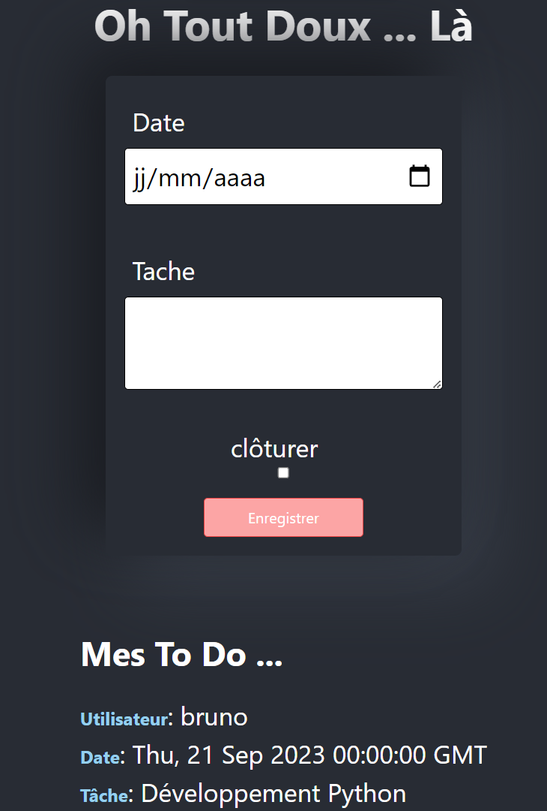
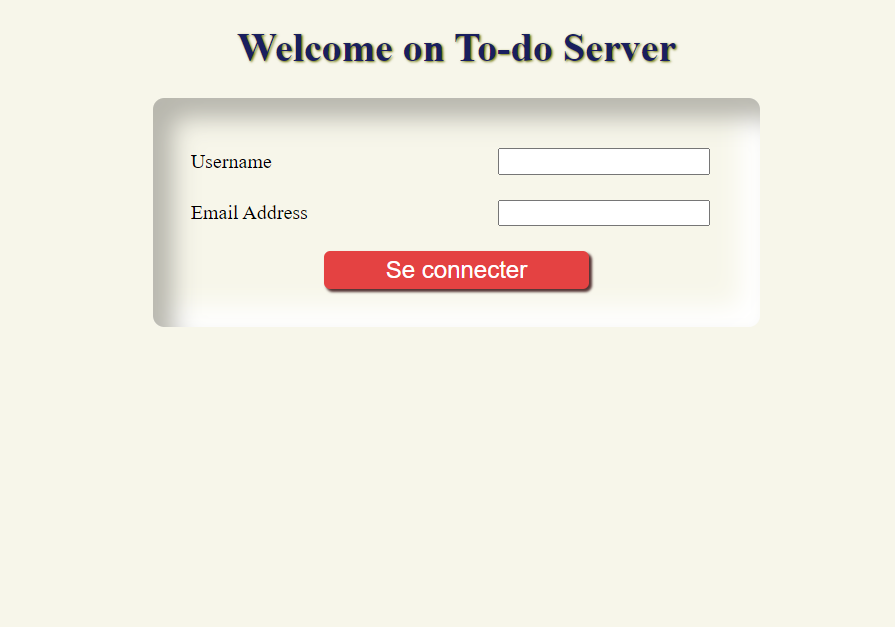

# Projet To-Do Flask serveur et React Client

Ce projet n'a pour but que de réunir au sein d'une seul application
un backend avec flask de Python et le frontend avec React.

initialement Flask fonctionne avec son propre moteur de rendu Jinja2, 
mais le potentiel de liberté d'architecture et de développement qu'offre Flaks et React et très intéressant.

C'est donc pour cela que je suis parti sur un projet simpliste afin que la structure puisse être transposable.

Les requêtes du client au serveur se font grâce à axios et au proxy ajouté au package.json afin de faciliter la gestion
CORS tout en permettant d'utiliser des url relative dans axios.

## Page frontend "to-do"

## Accès au server

# Flask Server and React Client To-Do Project
The sole purpose of this project is to bring together within a single application a backend with Python's Flask and the frontend with React.

Initially, Flask operates with its own rendering engine, Jinja2, but the potential for architectural freedom and development that Flask and React offer is very interesting.

That's why I embarked on a simplistic project so that the structure can be transferable.

Client requests to the server are made using axios and the proxy added to the package.json to facilitate CORS management while allowing the use of relative URLs in axios.

## Frontend to-do page

## Server access
